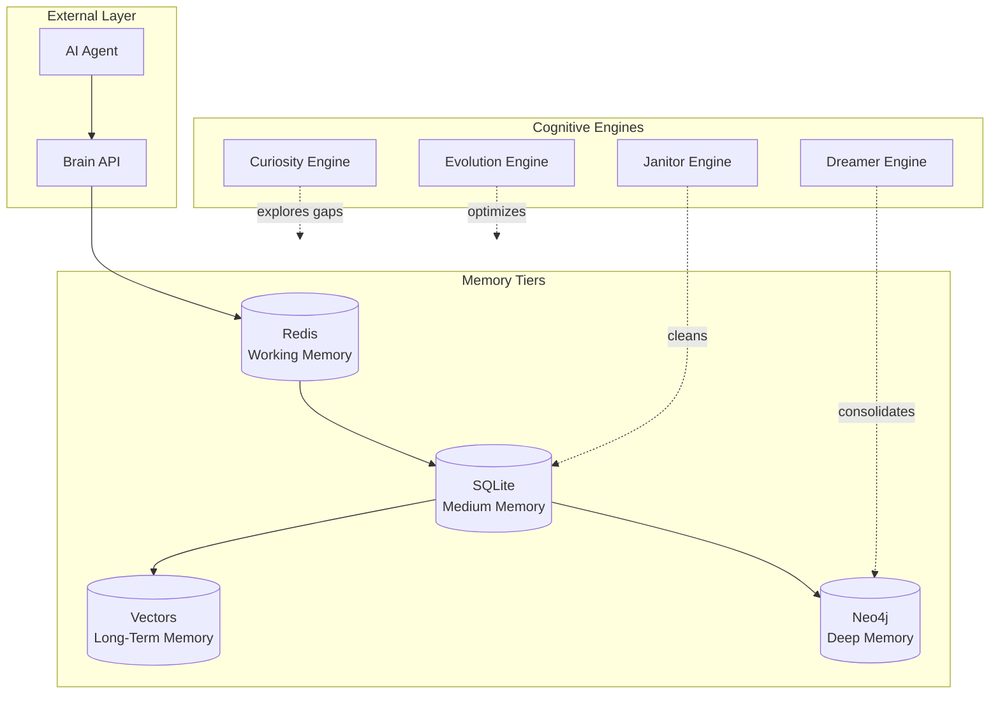

# Silhouette Brain 🧠

> Advanced 4-Tier Cognitive Memory System for AI Agents

[](https://opensource.org/licenses/MIT)
[](https://www.python.org/downloads/)
[](https://github.com/haroldfabla2-hue/silhouette-brain)
[](https://www.docker.com/)

**Silhouette Brain** is an advanced cognitive memory system designed for AI agents. It processes, cleans, and evolves information from its environment using AI, graph structures (Neo4j), and vector databases.

Originally built for OpenClaw agents, now decoupled to be **framework-agnostic** via HTTP API.

---

## 🎯 What is this?

Silhouette Brain implements a **4-Tier Memory Architecture** that mirrors human cognition:

```
┌─────────────────────────────────────────────────────────────┐
│                    SILHOUETTE BRAIN                        │
├─────────────────────────────────────────────────────────────┤
│                                                             │
│  ┌─────────────┐     ┌─────────────┐                       │
│  │  WORKING    │────▶│   MEDIUM    │────▶┌─────────────┐   │
│  │  (Redis)    │     │   (SQLite)  │     │    DEEP     │   │
│  │  Instant    │     │  Recent     │     │   (Neo4j)   │   │
│  └─────────────┘     └─────────────┘     │  Graph Rags  │   │
│         ▲                ▲               └─────────────┘   │
│         │                │                     ▲           │
│         └────────────────┴─────────────────┘           │
│                    COGNITIVE ENGINES                    │
│         Curiosity │ Janitor │ Dreamer │ Evolution        │
└─────────────────────────────────────────────────────────────┘
```

| Tier | Storage | Purpose | Speed |
|------|---------|---------|-------|
| **Working** | Redis / RAM | Ultra-fast ephemeral cache | ⚡⚡⚡ |
| **Medium** | SQLite | Recent episodes & context | ⚡⚡ |
| **Long-Term** | SQLite + Vectors | Persistent knowledge with embeddings | ⚡ |
| **Deep** | Neo4j Graph | Complex semantic relationships | Slow |

---

## 🧠 Cognitive Engines

| Engine | Function |
|--------|----------|
| **Curiosity** | Proactively explores the database for information "gaps" and formulates questions to fill voids |
| **Janitor** | Cleans recent memories, resolves contradictions (e.g., "I like coffee" vs "I hate coffee" → detects & reconciles) |
| **Dreamer** | Runs during low-activity periods, consolidates Medium → Deep memory into solid Neo4j graph connections |
| **Evolution** | Evaluates system performance metrics (truth verification rate) and proposes self-improvements |

---

## 🚀 Quick Start

### Prerequisites
- Python 3.10+
- Docker & Docker Compose

### One-Command Install

```bash
git clone https://github.com/haroldfabla2-hue/silhouette-brain.git && cd silhouette-brain && ./install.sh
```

### Manual Setup

```bash
# 1. Clone the repo
git clone https://github.com/haroldfabla2-hue/silhouette-brain.git
cd silhouette-brain

# 2. Copy environment file
cp .env.example .env

# 3. Edit .env with your API keys
#    - Embeddings: 100% Local (using fastembed) - NO API key needed!
#    - Reasoning (Optional): Configure your preferred model in REASONING_PROVIDER

# 4. Start the ecosystem
docker-compose up -d

# Brain API available at: http://localhost:9876
```

---

## 📡 API Usage

The API runs at `http://localhost:9876`.

### Query the Memory

```bash
curl "http://localhost:9876/api/reasoning/context?query=your_question"
```

### Response Structure

```json
{
  "query": "your_question",
  "synthesis": "AI-generated answer based on memory",
  "sources": [
    {"type": "graph", "data": "...", "confidence": 0.95},
    {"type": "vector", "data": "...", "confidence": 0.87}
  ],
  "reasoning_chain": ["step1", "step2", "step3"]
}
```

---

## 🏗️ Architecture

```
┌──────────────┐     ┌──────────────┐     ┌──────────────┐
│   Client     │────▶│  Brain API  │────▶│  Memory API  │
│   (Agent)    │◀────│  (FastAPI)  │◀────│  (Layered)  │
└──────────────┘     └──────────────┘     └──────────────┘
                                                 │
                    ┌───────────────────────────┼───────────────────────────┐
                    ▼                           ▼                           ▼
             ┌─────────────┐           ┌─────────────┐           ┌─────────────┐
             │    Redis    │           │   SQLite    │           │    Neo4j    │
             │   (Working) │           │   (Medium)  │           │    (Deep)   │
             └─────────────┘           └─────────────┘           └─────────────┘
```

---

## 💡 Use Cases

- **AI Agents** — Give your AI agents persistent, evolving memory
- **Chatbots** — Build context-aware conversational AI with long-term memory
- **Research Assistants** — AI that remembers and connects knowledge across sessions
- **Autonomous Systems** — Self-improving AI with cognitive cycles
- **Knowledge Graphs** — Structured memory with semantic relationships

---

## 🤝 Contributing

Contributions are welcome! Please read our guidelines and submit PRs.

```bash
# Run tests
pytest tests/

# Run linting
flake8 src/
```

---

## 📄 License

MIT License - See [LICENSE](LICENSE) for details.

---

## 🌟 Stars & Support

If Silhouette Brain helps your AI agents, please star the repo and share it with the community.

Built with ❤️ for the AI developer community.

---

## 🏗️ System Architecture



### Data Flow

```
┌─────────────┐
│   AGENT     │ ←─── Reasoning + Synthesis
└──────┬──────┘
       │
       ▼
┌─────────────────────────────────────────┐
│            BRAIN API (FastAPI)           │
│  ┌─────────────────────────────────┐  │
│  │   Memory Integration Layer        │  │
│  │  ┌───────┐ ┌───────┐ ┌─────┐  │  │
│  │  │Redis  │ │SQLite │ │Neo4j│  │  │
│  │  │ Cache │ │Medium │ │Graph │  │  │
│  │  └───────┘ └───────┘ └──┬──┘  │  │
│  └─────────────────────────┼───────┘  │
└────────────────────────────┼────────────┘
                           │
                           ▼
              ┌──────────────────────┐
              │  Cognitive Engines   │
              │ Curiosity │ Janitor  │
              │ Dreamer  │ Evolution │
              └──────────────────────┘
```

### Cognitive Engine Cycle

```
┌─────────────────────────────────────────────────────────────┐
│                    AGENT SESSION                            │
├─────────────────────────────────────────────────────────────┤
│                                                             │
│   ┌─────────┐    Store    ┌─────────┐   Consolidate   ┌─────────┐
│   │ Working │────────────▶│ Medium  │───────────────▶│   Deep  │
│   │ (Redis) │   session   │ (SQLite)│   nightly     │ (Neo4j) │
│   └─────────┘    data      └─────────┘                └─────────┘
│        ▲              ▲                                   │
│        │              │                                   │
│   ┌────┴──────────────┴────┐                    ┌────┴────┐
│   │   Curiosity Engine     │                    │ Dreamer │
│   │  Finds knowledge gaps  │                    │ Engine  │
│   └───────────────────────┘                    └─────────┘
│        ▲              │                              │
│        │              │                              │
│   ┌────┴──────────────┴────┐               ┌────┴────────┐
│   │   Janitor Engine       │               │ Evolution  │
│   │ Resolves conflicts    │               │  Engine   │
│   └───────────────────────┘               └───────────┘
└─────────────────────────────────────────────────────────────┘
```

---

## 📊 Performance Metrics

The system tracks:

| Metric | Description | Target |
|--------|-------------|--------|
| Truth Rate | Ratio of verified truths to total facts | >95% |
| Memory Efficiency | Relevant context retrieval rate | >90% |
| Cognitive Cycles | Auto-evolution runs per day | 4-6 |
| Gap Coverage | Knowledge gaps filled over time | 80% |

---

## 🛠️ Tech Stack

| Component | Technology | Purpose |
|-----------|------------|---------|
| **API** | FastAPI | HTTP endpoints |
| **Working Memory** | Redis | Session cache |
| **Medium Memory** | SQLite | Episode storage |
| **Long-Term Memory** | FastEmbed | Vector embeddings |
| **Deep Memory** | Neo4j | Knowledge graphs |
| **Orchestration** | Python asyncio | Concurrent engines |
| **Container** | Docker Compose | Full stack deploy |

---

## 📚 Further Reading

- [API Documentation](https://github.com/haroldfabla2-hue/silhouette-brain#api-usage)
- [Cognitive Engines Deep Dive](docs/cognitive_engines.md)
- [Architecture Decisions](docs/adr.md)
- [OpenClaw Integration](docs/openclaw.md)

---

## 🏭 Deployment & Services

Silhouette Brain is managed by **PM2** via `ecosystem.config.js`. The system runs as a set of coordinated services:

### Core Services

| Service | Manager | Command | Purpose |
|---------|---------|---------|---------|
| **Brain API** | PM2 | `silhouette-brain-api` | FastAPI HTTP server (:9876) |
| **Unified Daemon** | PM2 | `silhouette-unified-daemon` | Task scheduler + all 8 cognitive tasks |

### PM2 Management

```bash
# View all services
pm2 status

# View logs for a specific service
pm2 logs silhouette-unified-daemon --lines 100

# Restart a service
pm2 restart silhouette-unified-daemon

# Real-time monit
pm2 monit
```

### The Unified Daemon — 8 Scheduled Tasks

The daemon orchestrates all cognitive operations:

| Task | Interval | Type | Description |
|------|----------|------|-------------|
| `heartbeat` | 10min | in-process | Monitor brain_api, neo4j, redis health |
| `api_health` | 3min | in-process | HTTP health checks on Brain API |
| `session_sync` | 2min | subprocess | Sync agent sessions to Medium memory |
| `embedding_sync` | 5min | subprocess | Generate and store vector embeddings |
| `curiosity` | 1h | subprocess | Find knowledge gaps, generate investigations |
| `dreamer` | 6h | subprocess | Consolidate Medium → Deep memory |
| `janitor` | 12h | subprocess | Resolve entity contradictions |
| `evolution` | 6h | subprocess | Self-improvement evaluation |

See [docs/UNIFIED_DAEMON.md](docs/UNIFIED_DAEMON.md) for full technical reference.

### Process Architecture

```
PM2 (Process Manager)
├── silhouette-brain-api (FastAPI :9876)
│   └── Responds to agent memory requests
│
└── silhouette-unified-daemon (Python daemon)
    ├── Scheduler (ticks every 10s)
    ├── 2 in-process tasks (lightweight)
    └── 6 subprocess tasks (heavy: embeddings, cognitive engines)
            │
            ├── Redis (6379) ← Working memory
            ├── SQLite (data/memory_core.db) ← Medium memory
            ├── Neo4j (17687) ← Deep memory
            └── FastEmbed ← Vector embeddings
```

### Configuration

All configuration via `.env`:

```bash
# Core paths
BRAIN_ROOT=/root/silhouette-brain
BRAIN_SRC_DIR=/root/silhouette-brain/src/core
BRAIN_DATA_DIR=/root/silhouette-brain/data

# Reasoning (for cognitive engines)
REASONING_PROVIDER=minimax
REASONING_API_KEY=your_key_here
REASONING_MODEL=MiniMax-M2.5

# Storage
NEO4J_URI=bolt://localhost:17687
NEO4J_USER=neo4j
NEO4J_PASSWORD=silhouette2035
REDIS_URL=redis://localhost:6379
FASTEMBED_MODEL=sentence-transformers/paraphrase-multilingual-MiniLM-L12-v2
```

### Port Reference

| Port | Service | Protocol |
|------|---------|----------|
| 9876 | Brain API | HTTP (FastAPI) |
| 6379 | Redis | Redis protocol |
| 17687 | Neo4j | Bolt |

See [docs/ARCHITECTURE.md](docs/ARCHITECTURE.md) for complete system architecture.
