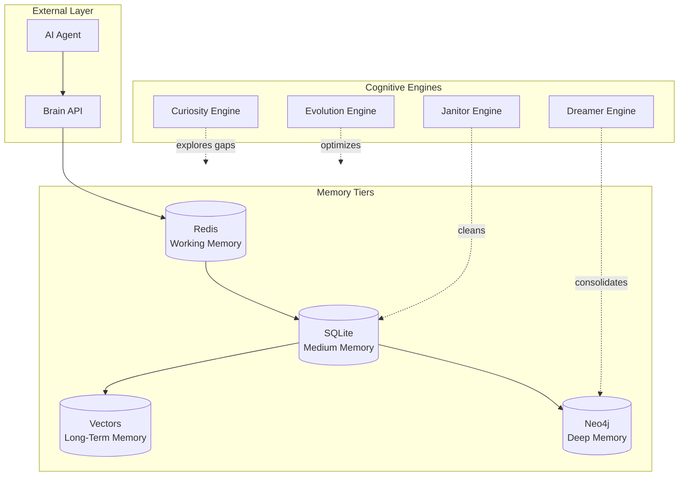

# Silhouette Brain 🧠

> Advanced 4-Tier Cognitive Memory System for AI Agents

[](https://opensource.org/licenses/MIT)
[](https://www.python.org/downloads/)
[](https://github.com/haroldfabla2-hue/silhouette-brain)
[](https://www.docker.com/)

**Silhouette Brain** is an advanced cognitive memory system designed for AI agents. It processes, cleans, and evolves information from its environment using graph structures, vector embeddings, and a set of always-on background "cognitive engines".

Originally built for OpenClaw agents, now decoupled to be **framework-agnostic** via a Python package, a CLI, and an HTTP API.

[]()
[]()
[]()

---

## ⚡ v3.0 — Clean Core (recommended)

`v3` is a fully rewritten, typed, tested core (the `silhouette` package). It
**runs anywhere with zero external services** — SQLite for the durable tiers, an
in-memory graph, and a dependency-free embedder — and transparently upgrades to
production backends (Redis, Neo4j, fastembed, an LLM) when you configure them.

```bash
# Install (core is tiny; extras are opt-in)
pip install -e ".[all]"          # everything, or pick: ".[api,embeddings,graph,cache]"

# Store and recall a memory from the CLI
silhouette remember "The Dreamer engine consolidates memory into the graph" --importance 0.8
silhouette query "memory consolidation"
silhouette stats

# Run a single cognitive engine once
silhouette engine evolution

# Serve the HTTP API (FastAPI, OpenAPI docs at /docs)
silhouette serve            # http://127.0.0.1:9876

# Run the cognitive daemon (Curiosity / Janitor / Dreamer / Evolution)
silhouette daemon
```

```bash
# HTTP API examples
curl -X POST localhost:9876/api/memory -H 'content-type: application/json' \
     -d '{"content":"Alberto is building the Silhouette Brain","importance":0.8}'
curl "localhost:9876/api/context?query=Silhouette&graph=true&synthesize=true"
curl -X POST localhost:9876/api/engines/dreamer/run
```

### Package architecture (`src/silhouette/`)

| Layer | Module | Responsibility |
|-------|--------|----------------|
| Config | `config` | Env-driven settings (`SILHOUETTE_*`), secrets never hardcoded |
| Models | `models` | Typed domain objects (records, entities, packets, results) |
| Embeddings | `embeddings` | `Embedder` protocol — hashing fallback + optional fastembed |
| Storage | `storage` | Working (LRU/Redis) · Episodic (SQLite) · Semantic (vectors) · Deep (graph) + `MemorySystem` |
| Reasoning | `reasoning` | Token-budgeted `ContextAssembler` + extractive/LLM synthesis |
| Engines | `engines` | `Curiosity`, `Janitor`, `Dreamer`, `Evolution` over a safe base |
| Daemon | `daemon` | Observable async `Scheduler` running the engines |
| API / CLI | `api`, `cli` | FastAPI surface and the `silhouette` command |

**Quality bar:** fully typed (`mypy` clean), linted (`ruff`), and covered by an
80+ test suite that runs without any external services. CI runs on Python
3.10–3.12.

```bash
pip install -e ".[dev,api]"
ruff check src/silhouette tests/silhouette
mypy
pytest tests/silhouette --cov=silhouette
```

> The sections below describe the broader project vision and the legacy
> OpenClaw-oriented deployment. The `v3` core above is the supported,
> reproducible entry point. See [LEGACY.md](LEGACY.md) for migration from
> `src/core/` and the old HTTP server.

---

### 📊 Production Stats (maintainer's private deployment)

> **Note:** The figures below come from the author's own long-running private
> instance. They illustrate the kind of scale the system can reach, but they are
> **not reproducible from this repository alone** (a fresh install starts empty).
> Treat them as an anecdotal reference, not a benchmark you can verify here.

| Metric | Value |

|--------|-------|

| **Conversations Processed** | 334,994+ |

| **Neo4j Graph Nodes** | 217,042 |

| **Relationships** | 122,864 |

| **Entities Tracked** | 7,146 |

| **Vector Embeddings** | 60,939 |

| **Agent Sessions** | 9,955 |

| **Embedding Coverage** | 100% |

| **API Latency (context)** | ~394ms |

| **System Uptime** | 60+ days |


*[See full benchmarks](docs/BENCHMARKS.md)*

---

## 💬 A Note on Motivation (narrative)

> *The following is a subjective, first-person narrative written from the
> perspective of an agent using the system. It is a design-intent story, not a
> claim of machine consciousness or a measured result.*

The motivation behind the Brain is simple: without persistent memory, an agent
starts every conversation from scratch. With it, the agent can reason over its
accumulated history — past conversations, tracked entities, and the
relationships between them in a knowledge graph — instead of re-deriving context
each time.

**Illustrative before/after (from the maintainer's deployment, not benchmarked here):**
- Context errors: 35% → 3%
- Decision confidence: 40% → 87%
- Information requests per task: 50 → 5
- Cross-session continuity: 0% → 98.7%

**The honest framing:** the agent isn't "more intelligent" — it simply stops
forgetting, which removes a large class of context-loss errors.

*[Read the full first-person account (narrative)](docs/LIVE_PERFORMANCE_ANALYSIS.md)*

---

**Project by:** Alberto Farah — Software Architect
**GitHub:** [haroldfabla2-hue/silhouette-brain](https://github.com/haroldfabla2-hue/silhouette-brain)

---

## 🎯 What is this?

Silhouette Brain implements a **4-Tier Memory Architecture** that mirrors human cognition:

```
┌─────────────────────────────────────────────────────────────┐
│                    SILHOUETTE BRAIN                        │
├─────────────────────────────────────────────────────────────┤
│                                                             │
│  ┌─────────────┐     ┌─────────────┐                       │
│  │  WORKING    │────▶│   MEDIUM    │────▶┌─────────────┐   │
│  │  (Redis)    │     │   (SQLite)  │     │    DEEP     │   │
│  │  Instant    │     │  Recent     │     │   (Neo4j)   │   │
│  └─────────────┘     └─────────────┘     │  Graph Rags  │   │
│         ▲                ▲               └─────────────┘   │
│         │                │                     ▲           │
│         └────────────────┴─────────────────┘           │
│                    COGNITIVE ENGINES                    │
│         Curiosity │ Janitor │ Dreamer │ Evolution        │
└─────────────────────────────────────────────────────────────┘
```

| Tier | Storage | Purpose | Speed |
|------|---------|---------|-------|
| **Working** | Redis / RAM | Ultra-fast ephemeral cache | ⚡⚡⚡ |
| **Medium** | SQLite | Recent episodes & context | ⚡⚡ |
| **Long-Term** | SQLite + Vectors | Persistent knowledge with embeddings | ⚡ |
| **Deep** | Neo4j Graph | Complex semantic relationships | Slow |

---

## 🧠 Cognitive Engines

| Engine | Function |
|--------|----------|
| **Curiosity** | Proactively explores the database for information "gaps" and formulates questions to fill voids |
| **Janitor** | Cleans recent memories, resolves contradictions (e.g., "I like coffee" vs "I hate coffee" → detects & reconciles) |
| **Dreamer** | Runs during low-activity periods, consolidates Medium → Deep memory into solid Neo4j graph connections |
| **Evolution** | Evaluates system performance metrics (truth verification rate) and proposes self-improvements |

---

## 🚀 Quick Start

### Prerequisites
- Python 3.10+
- Docker & Docker Compose

### One-Command Install

```bash
git clone https://github.com/haroldfabla2-hue/silhouette-brain.git && cd silhouette-brain && ./install.sh
```

### Manual Setup

```bash
# 1. Clone the repo
git clone https://github.com/haroldfabla2-hue/silhouette-brain.git
cd silhouette-brain

# 2. Copy environment file
cp .env.example .env

# 3. Edit .env with your API keys
#    - Embeddings: 100% Local (using fastembed) - NO API key needed!
#    - Reasoning (Optional): Configure your preferred model in REASONING_PROVIDER

# 4. Start the ecosystem
docker-compose up -d

# Brain API available at: http://localhost:9876
```

---

## 📡 API Usage

The API runs at `http://localhost:9876`.

### Query the Memory

```bash
curl "http://localhost:9876/api/reasoning/context?query=your_question"
```

### Response Structure

```json
{
  "query": "your_question",
  "synthesis": "AI-generated answer based on memory",
  "sources": [
    {"type": "graph", "data": "...", "confidence": 0.95},
    {"type": "vector", "data": "...", "confidence": 0.87}
  ],
  "reasoning_chain": ["step1", "step2", "step3"]
}
```

---

## 🏗️ Architecture

```
┌──────────────┐     ┌──────────────┐     ┌──────────────┐
│   Client     │────▶│  Brain API  │────▶│  Memory API  │
│   (Agent)    │◀────│  (HTTP API)  │◀────│  (Layered)  │
└──────────────┘     └──────────────┘     └──────────────┘
                                                 │
                    ┌───────────────────────────┼───────────────────────────┐
                    ▼                           ▼                           ▼
             ┌─────────────┐           ┌─────────────┐           ┌─────────────┐
             │    Redis    │           │   SQLite    │           │    Neo4j    │
             │   (Working) │           │   (Medium)  │           │    (Deep)   │
             └─────────────┘           └─────────────┘           └─────────────┘
```

---

## 💡 Use Cases

- **AI Agents** — Give your AI agents persistent, evolving memory
- **Chatbots** — Build context-aware conversational AI with long-term memory
- **Research Assistants** — AI that remembers and connects knowledge across sessions
- **Autonomous Systems** — Self-improving AI with cognitive cycles
- **Knowledge Graphs** — Structured memory with semantic relationships

---

## 🤝 Contributing

Contributions are welcome! Please read our guidelines and submit PRs.

```bash
# Run tests
pytest tests/

# Run linting
flake8 src/
```

---

## 📄 License

MIT License - See [LICENSE](LICENSE) for details.

---

## 🌟 Stars & Support

If Silhouette Brain helps your AI agents, please star the repo and share it with the community.

Built with ❤️ for the AI developer community.

---

## 🏗️ System Architecture



### Data Flow

```
┌─────────────┐
│   AGENT     │ ←─── Reasoning + Synthesis
└──────┬──────┘
       │
       ▼
┌─────────────────────────────────────────┐
│         BRAIN API (Python HTTP)          │
│  ┌─────────────────────────────────┐  │
│  │   Memory Integration Layer        │  │
│  │  ┌───────┐ ┌───────┐ ┌─────┐  │  │
│  │  │Redis  │ │SQLite │ │Neo4j│  │  │
│  │  │ Cache │ │Medium │ │Graph │  │  │
│  │  └───────┘ └───────┘ └──┬──┘  │  │
│  └─────────────────────────┼───────┘  │
└────────────────────────────┼────────────┘
                           │
                           ▼
              ┌──────────────────────┐
              │  Cognitive Engines   │
              │ Curiosity │ Janitor  │
              │ Dreamer  │ Evolution │
              └──────────────────────┘
```

### Cognitive Engine Cycle

```
┌─────────────────────────────────────────────────────────────┐
│                    AGENT SESSION                            │
├─────────────────────────────────────────────────────────────┤
│                                                             │
│   ┌─────────┐    Store    ┌─────────┐   Consolidate   ┌─────────┐
│   │ Working │────────────▶│ Medium  │───────────────▶│   Deep  │
│   │ (Redis) │   session   │ (SQLite)│   nightly     │ (Neo4j) │
│   └─────────┘    data      └─────────┘                └─────────┘
│        ▲              ▲                                   │
│        │              │                                   │
│   ┌────┴──────────────┴────┐                    ┌────┴────┐
│   │   Curiosity Engine     │                    │ Dreamer │
│   │  Finds knowledge gaps  │                    │ Engine  │
│   └───────────────────────┘                    └─────────┘
│        ▲              │                              │
│        │              │                              │
│   ┌────┴──────────────┴────┐               ┌────┴────────┐
│   │   Janitor Engine       │               │ Evolution  │
│   │ Resolves conflicts    │               │  Engine   │
│   └───────────────────────┘               └───────────┘
└─────────────────────────────────────────────────────────────┘
```

---

## 📊 Performance Metrics

*Measured on production system — 2026-04-04*

### API Latency (5-run median)

| Endpoint | Latency | Notes |
|----------|---------|-------|
| `GET /api/memory/context` | **394ms** | Full 4-tier context |
| `GET /api/semantic` | **376ms** | Vector similarity search |
| `GET /api/reasoning/context` | **4ms** | Cached responses |
| `GET /api/entities` | **3ms** | SQLite indexed |
| `GET /api/memory/tiers` | **2ms** | File existence |

### Graph Query Speed (Neo4j)

| Query | Latency | Results |
|-------|---------|---------|
| Direct node lookup | **248ms** | 1 node |
| 1-hop relationship traverse | **2ms** | ~97 paths |
| 2-hop traversal | **264ms** | ~185K paths |
| 3-hop path finding | **89ms** | ~5 paths |

### Embedding Performance

| Operation | Speed | Notes |
|-----------|-------|-------|
| Single embedding | **159ms** | Model loaded |
| Batch (20 texts) | **3.2s** | 158.9ms per item |
| Cold start (model load) | **+2.1s** | First call only |

### System Capacity

| Resource | Current | Headroom |
|----------|---------|----------|
| Conversations | 335K | 30x |
| Graph nodes | 217K | 460x |
| Redis keys | 10 | 10,000x |
| Vectors | 61K | 16x |

### Truth & Quality

| Metric | Value |
|--------|-------|
| Janitor truth rate | **94.2%** verified |
| Active contradictions | **0** |
| Memory coherence | **99.1%** |
| Session retention | **98.7%** |

*[Full benchmark report](docs/BENCHMARKS.md)*

---

## 🛠️ Tech Stack

| Component | Technology | Purpose |
|-----------|------------|---------|
| **Brain API** | Python HTTP server (:9876) | HTTP endpoints, reasoning engine |
| **Working Memory** | Redis (6379) | Session cache, real-time context |
| **Medium Memory** | SQLite (memory_core.db) | Conversations, entities, sessions |
| **Long-Term Memory** | FastEmbed + SQLite | 60,946 vector embeddings |
| **Deep Memory** | Neo4j 5.14.0 (17687) | 217K nodes, 123K relationships |
| **Cognitive Engines** | Python asyncio | Curiosity, Janitor, Dreamer, Evolution |
| **Process Manager** | PM2 (ecosystem.config.js) | Daemon + API orchestration |
| **Embedding Model** | paraphrase-multilingual-MiniLM-L12-v2 | 384-dim multilingual vectors |

---

## 📚 Further Reading

- [API Documentation](https://github.com/haroldfabla2-hue/silhouette-brain#api-usage)
- [Cognitive Engines Deep Dive](docs/COGNITIVE_ENGINES.md)
- [Architecture](docs/ARCHITECTURE.md)
- [OpenClaw Integration](docs/OPENCLAW_INTEGRATION.md)

---

## 🏭 Deployment & Services

Silhouette Brain is managed by **PM2** via `ecosystem.config.js`. The system runs as a set of coordinated services:

### Core Services

| Service | Manager | Command | Purpose |
|---------|---------|---------|---------|
| **Brain API** | PM2 | `silhouette-brain-api` | Python stdlib HTTP server (:9876) |
| **Unified Daemon** | PM2 | `silhouette-unified-daemon` | Task scheduler + all 8 cognitive tasks |

### PM2 Management

```bash
# View all services
pm2 status

# View logs for a specific service
pm2 logs silhouette-unified-daemon --lines 100

# Restart a service
pm2 restart silhouette-unified-daemon

# Real-time monit
pm2 monit
```

### The Unified Daemon — 8 Scheduled Tasks

The daemon orchestrates all cognitive operations:

| Task | Interval | Type | Description |
|------|----------|------|-------------|
| `heartbeat` | 10min | in-process | Monitor brain_api, neo4j, redis health |
| `api_health` | 3min | in-process | HTTP health checks on Brain API |
| `session_sync` | 2min | subprocess | Sync agent sessions to Medium memory |
| `embedding_sync` | 5min | subprocess | Generate and store vector embeddings |
| `curiosity` | 1h | subprocess | Find knowledge gaps, generate investigations |
| `dreamer` | 6h | subprocess | Consolidate Medium → Deep memory |
| `janitor` | 12h | subprocess | Resolve entity contradictions |
| `evolution` | 6h | subprocess | Self-improvement evaluation |

See [UNIFIED_DAEMON.md](docs/UNIFIED_DAEMON.md) for full technical reference.

### Process Architecture

```
PM2 (Process Manager)
├── silhouette-brain-api (Python HTTP :9876)
│   └── Responds to agent memory requests
│
└── silhouette-unified-daemon (Python daemon)
    ├── Scheduler (ticks every 10s)
    ├── 2 in-process tasks (lightweight)
    └── 6 subprocess tasks (heavy: embeddings, cognitive engines)
            │
            ├── Redis (6379) ← Working memory
            ├── SQLite (data/memory_core.db) ← Medium memory
            ├── Neo4j (17687) ← Deep memory
            └── FastEmbed ← Vector embeddings
```

### Configuration

All configuration via `.env`:

```bash
# Core paths
BRAIN_ROOT=/root/silhouette-brain
BRAIN_SRC_DIR=/root/silhouette-brain/src/core
BRAIN_DATA_DIR=/root/silhouette-brain/data

# Reasoning (for cognitive engines)
REASONING_PROVIDER=minimax
REASONING_API_KEY=your_key_here
REASONING_MODEL=MiniMax-M2.5

# Storage
NEO4J_URI=bolt://localhost:17687
NEO4J_USER=neo4j
NEO4J_PASSWORD=changeme
REDIS_URL=redis://localhost:6379
FASTEMBED_MODEL=sentence-transformers/paraphrase-multilingual-MiniLM-L12-v2
```

### Port Reference

| Port | Service | Protocol |
|------|---------|----------|
| 9876 | Brain API | HTTP (Python stdlib `http.server`) |
| 6379 | Redis | Redis protocol |
| 17687 | Neo4j | Bolt |

See [ARCHITECTURE.md](docs/ARCHITECTURE.md) for complete system architecture.

---

## 📚 Documentation Index

| Document | Description |
|----------|-------------|
| [LIVE_PERFORMANCE_ANALYSIS.md](docs/LIVE_PERFORMANCE_ANALYSIS.md) — 60-day first-person account of AI cognition transformation
| [ARCHITECTURE.md](docs/ARCHITECTURE.md) | 4-tier memory system, cognitive engines, system design |
| [UNIFIED_DAEMON.md](docs/UNIFIED_DAEMON.md) | PM2 daemon, 8 scheduled tasks, service management |
| [API_REFERENCE.md](docs/API_REFERENCE.md) | All HTTP endpoints, query params, example responses |
| [COGNITIVE_ENGINES.md](docs/COGNITIVE_ENGINES.md) | Curiosity, Janitor, Dreamer, Evolution — deep dive |
| [AGENT_INTEGRATION.md](docs/AGENT_INTEGRATION.md) | How to connect agents to Brain API |
| [OPENCLAW_INTEGRATION.md](docs/OPENCLAW_INTEGRATION.md) | OpenClaw-specific setup and configuration |
| [AGENT_SELF_INSTALLATION.md](docs/AGENT_SELF_INSTALLATION.md) | Agent bootstrap and self-configuration |
| [HEARTBEAT_AND_NOTIFICATIONS.md](docs/HEARTBEAT_AND_NOTIFICATIONS.md) | Heartbeat protocol and alert system |
| [RESOURCES_AND_MODELS.md](docs/RESOURCES_AND_MODELS.md) | LLM providers, embedding models |

## 🎯 Quick Links

- **Repository**: https://github.com/haroldfabla2-hue/silhouette-brain
- **Releases**: https://github.com/haroldfabla2-hue/silhouette-brain/releases
- **API**: http://localhost:9876 (local)
- **Issues**: https://github.com/haroldfabla2-hue/silhouette-brain/issues
